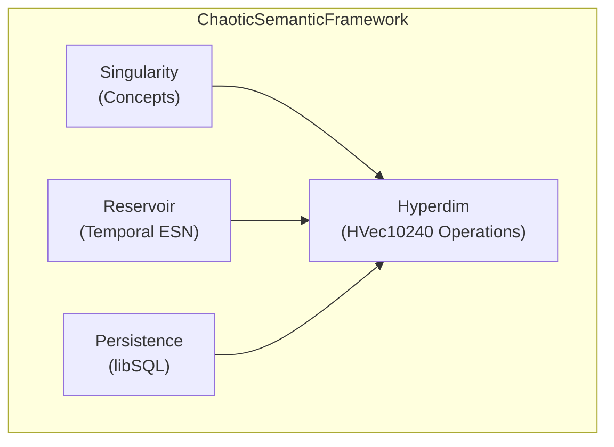

# Draw.io Architecture Diagrams

## When to Use This Skill

Use this skill when you need to:

- Create system architecture diagrams for the `chaotic_semantic_memory` crate
- Visualize module relationships and data flows
- Generate `.drawio` files for documentation
- Create diagrams from plans/ folder content (GOALS.md, ACTIONS.md, GOAP_STATE.md)

## Inline Diagram Output (Responses & Plan Files)

When rendering a diagram **inline** (in a chat response, plan file, or terminal output),
**NEVER use raw ASCII box art**. ASCII characters misalign because LLMs cannot guarantee
consistent character widths across fonts and terminal environments.

### Output Format Rules

| Context | Format |
|---|---|
| Inline response / plan file | Fenced `mermaid` block |
| Saved file in `docs/architecture/` | `.drawio` XML |
| README embed | PNG exported from `.drawio` |

### Canonical Inline Diagram - ChaoticSemanticFramework



This renders pixel-perfectly in GitHub, VS Code, and all markdown viewers.
No character counting. No alignment bugs.

## Diagram Types for This Project

### High-Level Architecture Diagram

Create diagrams showing:

- Core modules: `hyperdim`, `reservoir`, `singularity`, `persistence`, `framework`
- Data flow: Input -> Reservoir -> Singularity -> Persistence
- WASM boundary with conditional compilation
- External dependencies: libsql, tokio, rayon

### Module Relationship Diagram

Show interactions between:

- `HVec10240` (hyperdimensional vectors)
- `Reservoir` (echo state network)
- `Singularity` (concept storage + search)
- `ChaoticSemanticFramework` (orchestrator)
- `Persistence` (libsql/Tokio)

### GOAP Visualization

Map actions from `plans/ACTIONS.md`:

- Phase 1: Correctness fixes
- Phase 2: Performance optimizations
- Phase 3: Capabilities

## Creating Diagrams

### Option 1: Generate Tool (draw.io GUI)

1. Open draw.io
2. Click the sparkle (✨) Generate tool in toolbar
3. Describe the architecture you want
4. Adjust layout and styling

### Option 2: MCP Server (if available)

```
# Use drawio MCP server for programmatic generation
# Requires MCP access configured in session
```

### Option 3: Manual XML Creation

Create `.drawio` files with this structure:

```xml
<mxfile host="app.diagrams.net">
  <diagram name="Architecture">
    <mxGraphModel><root>
      <mxCell id="0"/>
      <mxCell id="1" parent="0"/>
    </root></mxGraphModel>
  </diagram>
</mxfile>
```

## Styling Guidelines

| Element | Style |
|---|---|
| Modules | Rounded rectangles, blue fill |
| External deps | Gray fill, dashed border |
| Data flow | Arrow connectors, solid |
| WASM boundary | Dotted rectangle, orange |
| Actions/Goals | Hexagons, green |

## Output Locations

- Save diagrams to `docs/architecture/`
- Use `docs/architecture/high-level-arch.drawio`
- Export PNG versions for README: `docs/architecture/high-level-arch.png`

## Best Practices

1. **Never use raw ASCII art** for inline diagram output - use `mermaid` fenced blocks
2. **Start high-level**: Show module boundaries first, then detail
3. **Consistent styling**: Use same colors/shapes for similar elements
4. **Include legend**: Explain shapes and colors
5. **Export PNG**: For embedding in Markdown/HTML docs
6. **Version control**: Commit `.drawio` XML, not PNG
