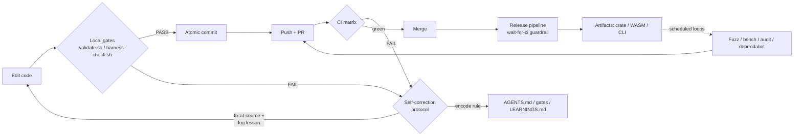

# HARNESS.md — Validation Harness for chaotic_semantic_memory

> Adopted via [ADR-0090: Harness Engineering & rust-2026-template Alignment](plans/adr/0090-harness-engineering-template-alignment.md).

This crate is an HDC/reservoir memory system (`chaotic_semantic_memory`): a
hyperdimensional computing (HDC) encoder mated to an echo-state reservoir, with
framework/persistence/CLI/WASM surfaces. The harness treats **validation as a
sensor network** that feeds corrections back into the engineering loop.

## Purpose

- **Turn errors into corrections.** Every failure is a signal: fix it at the
  source, then encode the lesson as a rule (AGENTS.md rule, lint, test, or
  hard constraint) so the same error cannot recur. See
  [agents-docs/self-learning-patterns.md](agents-docs/self-learning-patterns.md).
- **CI is the source of truth.** Local gates are a fast proxy; the merged state
  is what CI ([.github/workflows/ci.yml](.github/workflows/ci.yml)) verifies,
  and nothing merges or releases while CI is red.
- **Sensors vs. guides.** Sensors (below) detect state; guides
  ([AGENTS.md](AGENTS.md), skills) tell the agent how to correct it. The
  `scripts/harness-check.sh` bridge prints the guide hint next to each violation.

## Sensor Map

| Gate | Command | Signal |
|------|---------|--------|
| Format | `cargo fmt --all -- --check` | Unformatted code |
| Lint | `cargo clippy --all-targets --all-features -- -D warnings` | Clippy pedantic + `unwrap_used`/`expect_used`/`panic` warnings (exempt in tests per `.clippy.toml`) |
| Tests | `cargo test --all-targets --all-features` (plus `--no-run` warning gate) | Test failures **and** any build warning under `--all-features` |
| LOC | `bash scripts/validate.sh` (src/crates ≤ 500 LOC) + [tests/arch_fitness.rs](tests/arch_fitness.rs) (compile-time) | Per-file LOC exceedance, layering violations, `unsafe` outside `hyperdim_simd.rs` |
| API surface | `bash scripts/validate.sh` (regenerates `llms-full.txt`) | `> 5000` public symbols |
| Mutation | `bash scripts/mutation_test.sh fast --ci` | Mutation score < 85% (75% on draft PRs), report in `progress/mutation/` |
| Security | `cargo deny check` ([deny.toml](deny.toml)); `cargo audit` inside [pre-release-gate.yml](.github/workflows/pre-release-gate.yml); weekly [dependabot](.github/dependabot.yml) | License/bans/advisory violations; new vulnerabilities (audit reports, does not fail) |
| ADR parity | `bash scripts/check-adr-parity.sh` | Registry (`plans/ADR_REGISTRY.md`) ↔ on-disk ADR drift (ADR-0076) |
| Dist | `bash scripts/wasm_size_gate.sh`, `cli-npm` pack smoke test, `bash scripts/pre-release-validate.sh`, `verify-memory-roundtrip.sh` | WASM size cap (~870 KB), CLI tarball installs, version sync, persistence round-trip |
| Arch fitness | `cargo test --test arch_fitness` | Module layering, LOC gate, API stability |

Run any single sensor with agent-optimized output:

```bash
./scripts/harness-check.sh clippy   # fmt | clippy | deny | test | arch | all
```

### Honor System

Sensors below are best-effort. Missing tool → the gate prints *skip* and the
harness moves on (e.g. shellcheck crashes on path references; `cargo-deny`,
`cargo-nextest`, `markdownlint` optional locally). CI pins the truth for the
ones it runs. Do not weaken a gate to dodge a failure — weaken it only when
CI itself changes the policy.

## Loops

### Local dev loop (edit → test → fix)

1. Load state: [plans/GOAP_STATE.md](plans/GOAP_STATE.md), [plans/ACTIONS.md](plans/ACTIONS.md).
2. Edit (read first; match existing style; never bulk-edit).
3. Run `bash scripts/validate.sh` — all gates in one command.
4. On failure, fix at the source, then re-run. Loop until green.
5. If it was a systemic trap, encode the correction (AGENTS.md / hard constraint).

### PR loop (atomic commits → CI)

1. Branch from `main`: `git checkout -b <type>/<scope>-<description>`.
2. One logical change per commit (`feat(singularity): …`, `fix(persistence): …`).
3. Push, open PR; `gh pr checks --watch` waits for CI.
4. CI runs commitlint, lint, test (including workspace crates + DuckDB), WASM,
   MCP, and mutation on PRs.
5. Merge only when the whole matrix is green. **Never `gh pr merge --auto`
   across multiple PRs** — the "up to date with base" rule creates rebase
   loops: merge one → rebase the next → wait → merge.

### Release loop (branch → PR → CI → artifact)

1. Version bump (Cargo.toml + wasm/package.json + CHANGELOG.md, `cargo build
   --release` to sync Cargo.lock) in one atomic commit on a branch → PR.
2. CI must pass on all platforms (macos-arm64, windows-x64, linux).
3. After merge, [release.yml](.github/workflows/release.yml) runs its
   `wait-for-ci` guardrail job — no tag/release while CI is red.
4. [pre-release-gate.yml](.github/workflows/pre-release-gate.yml) adds a final
   audit, then [dist.yml](.github/workflows/dist.yml) publishes artifacts on
   `v*` tags (crates.io + npm provenance per `dist-channel-selection` skill).

### Scheduled loops

- **Fuzzing** — `fuzz/` workspace (cargo-fuzz targets). Local/adhoc; not yet CI-scheduled.
- **Benchmark** — [benchmark-ci.yml](.github/workflows/benchmark-ci.yml) on
  `src/**` / `benches/**` changes; `benchmarking-perf` skill for analysis.
- **Pre-release gate** — audit + validation invoked by release manual dispatch.
- **Dependabot** — [dependabot.yml](.github/dependabot.yml), weekly (Mon 09:00
  UTC), groups patch+minor, ignores major; every update lands as a normal PR and
  follows the PR loop.

## Agent Self-Correction Protocol

When a sensor fires, run this loop — never paper over the signal:

1. **Read state files** — `plans/GOAP_STATE.md`, `plans/ACTIONS.md`,
   `agents-docs/hard-constraints.md`, then the failing gate's hints.
2. **Reproduce** — `bash scripts/harness-check.sh <sensor>`; if it fails,
   run the raw command from the sensor map to capture the exact error.
3. **Fix at source** — use the crate's error conventions (`MemoryError::invalid_input`,
   `::database`), never `unwrap()` in library code; remove the root cause, not
   the symptom.
4. **Re-run gates** — `bash scripts/validate.sh`, then push and watch CI. A
   working one-file fix that breaks the suite is not a fix.
5. **Encode the correction** — compound engineering: if the trap is systemic,
   add the rule to AGENTS.md or a gate; log new patterns to
   `progress/LEARNINGS.md`.
6. **Update plans state** — set `plans/ACTIONS.md` status
   (`queued|in_progress|complete|blocked|deferred`) and
   `action_last_completed` **exactly once** in `plans/GOAP_STATE.md`
   (duplicates are silently dead under YAML last-key-wins).

### Structured error output (harness-check.sh)

```text
❌ HARNESS VIOLATION [clippy]
  AGENT FIX HINT: Fix all warnings. Check .clippy.toml for allowed exceptions.
  Do not add #[allow(...)] without justification comment.
  See HARNESS.md for the full sensor ↔ guide map.
```

## Feedback Loop



## Guides (what a sensor failure *should* route to)

[Sensors](scripts/validate.sh) · [Unified gate](scripts/quality-gates.sh) ·
[Mutation](scripts/mutation_test.sh) · [ADR parity](scripts/check-adr-parity.sh) ·
[Release](scripts/release-manager.sh) · [Pre-release](scripts/pre-release-validate.sh) ·
[Self-fix loop](scripts/self-fix-loop.sh) · [AGENTS.md workflow](AGENTS.md) ·
[testing-validation](.agents/skills/testing-validation/SKILL.md) ·
[github-ci-guardrails](.agents/skills/github-ci-guardrails/SKILL.md) ·
[release-management](.agents/skills/release-management/SKILL.md)